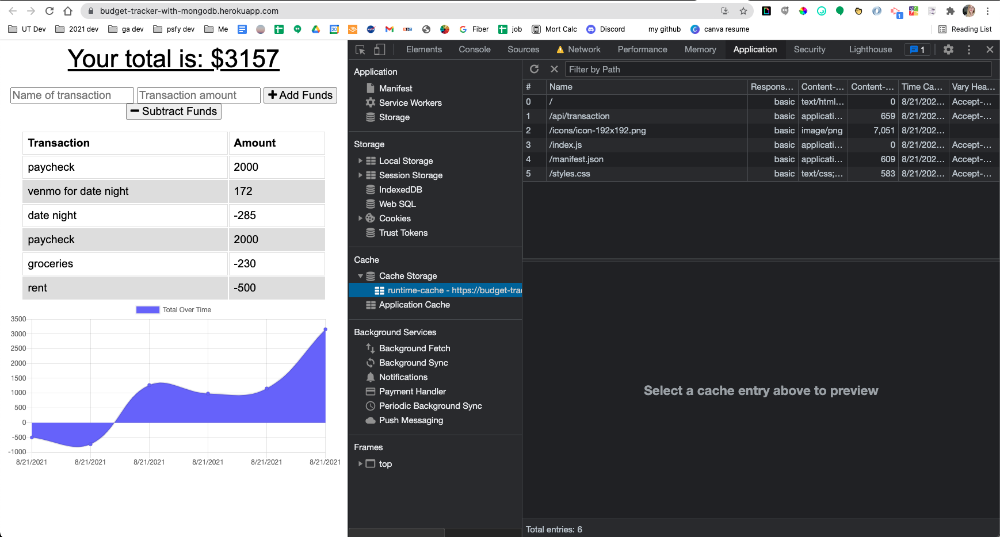
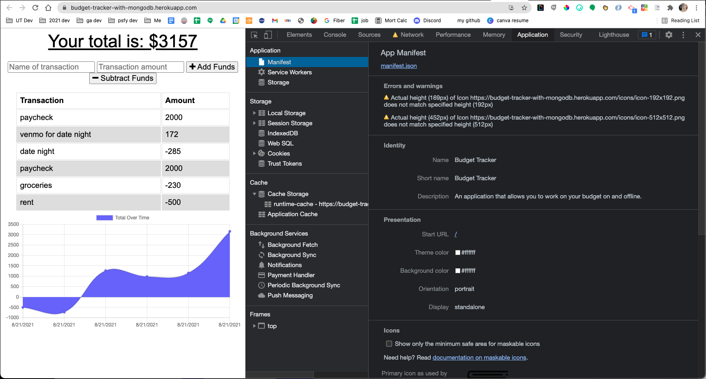
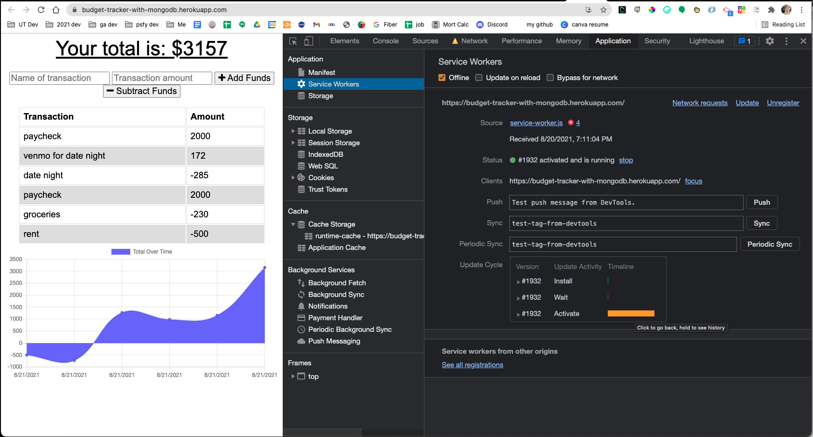

# Budget-Tracker-PWA-MongoDB
### Fullstack App that gives user ability to add expenses and deposits to their budget with or without internet connection. When entering transactions offline, they should populate the total when brought back online. Uses MongoDB, ES6 JS, HTML, CSS, Express.

## Table of Contents

**[Quick Links](#Quick-Links)**<br>
**[First Looks](#First-Looks)**<br>
**[Wireframes](#Wireframes)**<br>
**[Bugs and Known Issues](#Bugs-and-Known-Issues)**<br>
**[Next Steps to Continue](#Next-Steps-to-Continue)**<br>
**[Acceptance Criteria](#Acceptance-Criteria)**<br>
**[Bonus](#Bonus)**<br>
**[Deliverables](#Deliverables)**<br>
**[License](#License)**<br>

## Quick Links

- click here to view --> [final website](https://budget-tracker-with-mongodb.herokuapp.com/)

- click here to view --> [README GUIDE from UT](https://github.com/the-Coding-Boot-Camp-at-UT/UTA-VIRT-FSF-FT-06-2021-U-LOL/blob/master/01-HTML-Git-CSS/02-Homework/Homework-Guide/README.md)

- ## First Looks
# 
# 
# 

## Wireframes

- n/a

## Bugs and Known Issues

- n/a


## Next Steps to Continue

### Next Steps for App UI and Functionality

- n/a


### Next Steps for Code

- n/a


## Acceptance Criteria
```
GIVEN a user is on Budget App without an internet connection
WHEN the user inputs a withdrawal or deposit
THEN that will be shown on the page, and added to their transaction history when their connection is back online.

Offline Functionality:

  * Enter deposits offline

  * Enter expenses offline

When brought back online:

  * Offline entries should be added to tracker.
```

## User Story

* AS AN avid traveller
* I WANT to be able to track my withdrawals and deposits with or without a data/internet connection
* SO THAT my account balance is accurate when I am traveling

## Business Context

* Giving users a fast and easy way to track their money is important, but allowing them to access that information anytime is even more important. Having offline functionality is paramount to our applications success.

- - -


### Bonus

- 1. Transpile JS for compatibility with other browsers (Safari/iOS)
- 2. Use of the Airbnb style guide
- 3. Unit tests for critical functions
- 4. Use JSDocs 3 pattern for comments
- 5. Write a list of bugs or known issues for your implementation if needed


### Deliverables

- 1. All source files
- 2. All created files (unminified)
- 3. GitHub repository link in UT Portal
- 4. Heroku live website link in UT Portal

### License

[MIT License](https://opensource.org/licenses/MIT)


**[Back Up To Top](#Budget-Tracker-PWA-MongoDB)**
